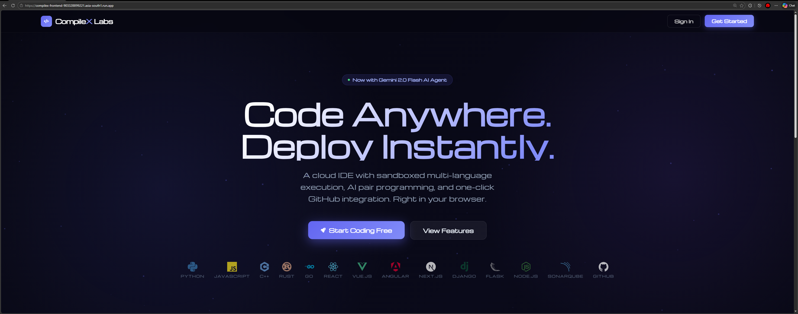
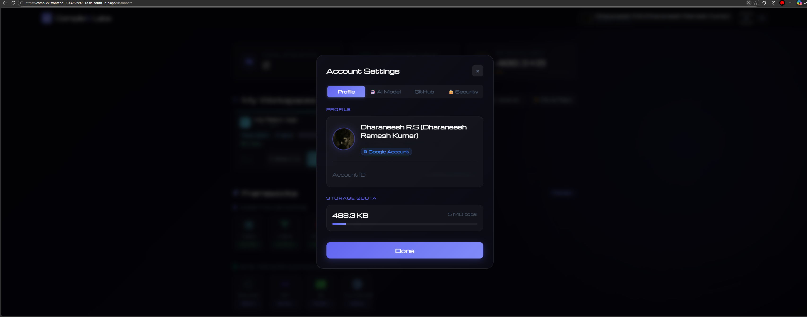

<div align="center">
  
  <h1>CompileX Labs</h1>
  <p><strong>The Ultimate Cloud Development Environment & Sandbox</strong></p>
  <p>Execute Code Anywhere. Deploy Instantly.</p>

  <br />

  <a href="https://compilex-frontend-903328899221.asia-south1.run.app/" target="_blank">
    
  </a>

  <br /><br />

  > ⚠️ **Hosted instance is live until March 13, 2026.** After that, use the Docker release for local self-hosting.

</div>

---


**A modern, AI-powered cloud IDE — code, run, and chat with AI in your browser.**

**CompileX Labs** is a cloud-hostable, full-stack, browser-based Integrated Development Environment (IDE) built for seamless AI-assisted development, multi-platform framework scaffolding, and complete network-isolated execution via Docker containers.

---

## 🌐 Hosted Live App

| Link | Availability |
|------|-------------|
| [**compilex-frontend-903328899221.asia-south1.run.app**](https://compilex-frontend-903328899221.asia-south1.run.app/) | ✅ Live — **until March 13, 2026** |

> After March 13, 2026, the hosted cloud instance will be taken offline. Use the [**Docker release**](#-releases--docker-images) below to self-host locally with zero authentication requirements.

---

## ✨ Core Capabilities

- 🚀 **Multi-Language Sandbox**: Execute Python, JavaScript, C++, Rust, Go, and more seamlessly via instantly provisioned, deeply tracked Docker containers.
- 🤖 **AI Code Agent**: A Gemini-powered (or local LLM) assistant that reads your code and live terminal outputs, explains bugs, writes code, and handles file manipulation intuitively.
- 🌐 **Full-Stack Frameworks**: Out-of-the-box, one-click scaffolding, execution, and local hosting via open ports for React, Vue.js, Angular, Next.js, Django, Flask, and Node.js.
- 💡 **Local AI & LM Studio**: Run the AI pair-programmer in absolute privacy by dynamically routing prompts and API requests to Ollama or LM Studio models.
- 🛠 **Customizable Layout & Root Terminal**: Get complete control with a VS Code-style draggable UI array, resizable panes, and direct pseudo-tty root terminal access.
- 🔍 **SonarCloud Integration**: Continuous code quality, security vulnerability, and code smell analysis — automated on every push via SonarCloud CI pipelines.
- 🔗 **One-Click GitHub Integration**: Track repos seamlessly! Push your code changes directly to any GitHub repository from inside the editor with conflict resolution.
- 🛡 **Secure Execution**: Every user workspace runs inside network-isolated Docker wrappers equipped with custom hardware RAM and CPU core limits for complete host safety.

---

## 🆕 Novelty & Key Innovations

### 🧠 Agent-Oriented Building

CompileX Labs introduces a first-class **Agent-Oriented Development** model — the built-in AI agent doesn't just answer questions, it *acts*. The agent can:

- Read and write files directly inside the live Docker workspace container
- Parse real-time terminal output to self-correct and retry execution
- Scaffold full project structures (components, routes, models) autonomously from a single natural-language prompt
- Chain multi-step tool calls: create file → install dependency → run → observe output → fix error — all without human intervention

This moves beyond traditional copilot "suggestions" toward a true **agentic development loop** where the AI drives the build cycle end-to-end.

### ☁️ SonarCloud Static Analysis Pipeline

CompileX Labs ships with a fully integrated **SonarCloud** CI/CD quality gate:

- Automated code smell, bug, and vulnerability scanning on every commit via GitHub Actions
- Security hotspot detection with OWASP category mapping
- Dedicated project dashboard for real-time quality metrics and tech debt tracking
- Zero-config setup — the pipeline activates automatically on repository push

This ensures production-grade code hygiene is enforced continuously, not as an afterthought.

---

## 📸 Gallery

<table>
  <tr>
    <td align="center"><br/><sub>Landing Page</sub></td>
    <td align="center"><br/><sub>Email Login</sub></td>
    <td align="center"><br/><sub>GitHub SSO Login</sub></td>
  </tr>
  <tr>
    <td align="center"><br/><sub>Firebase Email Verification</sub></td>
    <td align="center"><br/><sub>Dashboard — Frameworks</sub></td>
    <td align="center"><br/><sub>Account Settings</sub></td>
  </tr>
  <tr>
    <td align="center"><br/><sub>Workspace — CompileX Style</sub></td>
    <td align="center"><br/><sub>Workspace — VS Codeium Style</sub></td>
    <td align="center"><br/><sub>Language Sandbox</sub></td>
  </tr>
  <tr>
    <td align="center"><br/><sub>AI Agent Configuration</sub></td>
    <td align="center"><br/><sub>SonarCloud Project Analysis</sub></td>
    <td align="center"><br/><sub>GCP Cloud Run Deployment</sub></td>
  </tr>
  <tr>
    <td align="center"><br/><sub>GitHub Repo Import</sub></td>
    <td align="center"><br/><sub>Git Token — Push / Pull / Merge</sub></td>
    <td align="center"></td>
  </tr>
</table>

---

## 🏗 System Architecture

The ecosystem operates seamlessly using a micro-service inspired hierarchy.

1. **Frontend**: React + Vite (Vanilla CSS, React-Router)
2. **Backend Engine**: Python (Flask, PyMongo, WebSockets/Socket.IO)
3. **Execution Layer**: Docker Engine API (`docker container run`)
4. **Database Storage**: MongoDB (Persisting User Configurations, Workspace Auth, Token Storage)
5. **AI Orchestration**: Direct SDK requests (Google Generative AI, OpenAI, DeepSeek, Anthropic, Ollama)
6. **Code Quality**: SonarCloud (GitHub Actions CI pipeline — automated static analysis)

---

## 📦 Releases & Docker Images

> Self-host the entire CompileX Labs stack locally with a single `docker compose` command — **no Firebase account, no cloud auth, no external dependencies required.**

Pre-built Docker images are published on the [**Releases**](../../releases) page for every tagged version.

### Pull & Run Locally (MongoDB included)

Use the bundled Compose file — it spins up the backend, frontend, **and a local MongoDB instance** all together:

```bash
# Clone the repo
git clone https://github.com/your-org/compilex.git
cd compilex

# Create backend/.env with local config (no cloud auth needed)
cat > backend/.env << 'ENVEOF'
MONGO_URI=mongodb://mongo:27017/compilex
SECRET_KEY=local-dev-secret-key
GEMINI_API_KEY=your_optional_gemini_key
OLLAMA_BASE_URL=http://host.docker.internal:11434
DISABLE_FIREBASE_AUTH=true
ENVEOF

# Start everything — backend + frontend + MongoDB, no auth required
docker compose up
```

> Frontend: `http://localhost:5174` · Backend API: `http://localhost:5000` · MongoDB: `localhost:27017`

### What's in each release

| Asset | Description |
|-------|-------------|
| `compilex-backend-<version>.tar` | Standalone backend Docker image tarball |
| `compilex-frontend-<version>.tar` | Standalone frontend Docker image tarball |
| `docker-compose.yml` | Full-stack Compose file with embedded MongoDB service |
| `Source code (zip / tar.gz)` | Full repository snapshot |

### Local Mode — No Authentication Required

When `DISABLE_FIREBASE_AUTH=true` is set in the backend environment, CompileX Labs runs in **local-only mode**:

- Firebase email/SSO login is bypassed — any username/password is accepted for local dev
- All workspace data is stored in the bundled local MongoDB container (`mongo` service in Compose)
- No Google Cloud, AWS, or external service credentials are needed
- Fully air-gapped operation supported — works completely offline (except optional AI API calls)

---

## ⚡ Getting Started (Manual Local Deployment)

Run CompileX Labs on your local machine without Docker:

### 1. Prerequisites
- **Node.js**: v18+
- **Python**: v3.12+
- **Docker Desktop / Engine**: Must be active and running
- **MongoDB**: Active connection string or local daemon

### 2. Configure Environment Secrets

Create a `.env` inside `/backend`:

```env
MONGO_URI=mongodb://localhost:27017/compilex
SECRET_KEY=super-secret-compiler-key
GEMINI_API_KEY=your_gemini_key_here
OLLAMA_BASE_URL=http://localhost:11434
```

### 3. Spin up the Database and Engine (Backend)

Run everything inside an active Python Virtual Environment:

```bash
cd backend
python -m venv venv
venv\Scripts\activate   # Linux/Mac: source venv/bin/activate
pip install -r requirements.txt
python app.py
```

> The API layer and Socket connection will establish on `http://127.0.0.1:5000`

### 4. Build and Run the Dashboard (Frontend)

Open a new terminal session, keeping the backend alive:

```bash
cd frontend
npm install
npm run dev
```

> Launch the developer interface at `http://localhost:5174` and log in to start deploying secure framework applications!

---

<div align="center">
  <br />
  <p>Built with ❤️ for the modern engineer.</p>
  <sub>Hosted live until <strong>March 13, 2026</strong> — then available exclusively via Docker self-hosting.</sub>
</div>
