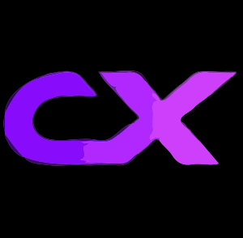

<div align="center">
  
  <h1>CompileX Labs</h1>
  <p><strong>The Ultimate Cloud Development Environment & Sandbox</strong></p>
  <p>Execute Code Anywhere. Deploy Instantly.</p>
</div>

---

**CompileX Labs** is a locally-hostable, full-stack, browser-based Integrated Development Environment (IDE) built for seamless AI-assisted development, multi-platform framework scaffolding, and complete network-isolated execution via Docker containers.

## ✨ Core Capabilities

- 🚀 **Multi-Language Sandbox**: Execute Python, JavaScript, C++, Rust, Go, and more seamlessly via instantly provisioned, deeply tracked Docker containers.
- 🤖 **AI Code Agent**: A Gemini-powered (or local LLM) assistant that reads your code and live terminal outputs, explains bugs, writes code, and handles file manipulation intuitively.
- 🌐 **Full-Stack Frameworks**: Out-of-the-box, one-click scaffolding, execution, and local hosting via open ports for React, Vue.js, Angular, Next.js, Django, Flask, and Node.js.
- 💡 **Local AI & LM Studio**: Run the AI pair-programmer in absolute privacy by dynamically routing prompts and API requests to Ollama or LM Studio models.
- 🛠 **Customizable Layout & Root Terminal**: Get complete control with a VS Code-style draggable UI array, resizable panes, and direct pseudo-tty root terminal access.
- 🔍 **SonarQube Scanner**: Access instant code quality, security vulnerability, and code smell analysis natively through the project dashboard.
- 🔗 **One-Click GitHub Integration**: Track repos seamlessly! Push your code changes directly to any GitHub repository from inside the editor with conflict resolution.
- 🛡 **Secure Execution**: Every user workspace runs inside network-isolated Docker wrappers equipped with custom hardware RAM and CPU core limits for complete host safety.

## 🏗 System Architecture

The ecosystem operates seamlessly using a micro-service inspired hierarchy.

1. **Frontend**: React + Vite (Vanilla CSS, React-Router)
2. **Backend Engine**: Python (Flask, PyMongo, WebSockets/Socket.IO)
3. **Execution Layer**: Docker Engine API (`docker container run`)
4. **Database Storage**: MongoDB (Persisting User Configurations, Workspace Auth, Token Storage)
5. **AI Orchestration**: Direct SDK requests (Google Generative AI, OpenAI, DeepSeek, Anthropic, Ollama)

## ⚡ Getting Started (Local Deployment)

Run CompileX Labs on your local machine instantly:

### 1. Prerequisites
- **Node.js**: v18+
- **Python**: v3.12+ 
- **Docker Desktop / Engine**: Must be active and running
- **MongoDB**: Active connection string or local daemon

### 2. Configure Environment Secrets
Create a `.env` inside `/backend`:

```env
MONGO_URI=mongodb://localhost:27017/compilex
SECRET_KEY=super-secret-compiler-key
GEMINI_API_KEY=your_gemini_key_here
OLLAMA_BASE_URL=http://localhost:11434
```

### 3. Spin up the Database and Engine (Backend)

Run everything inside an active Python Virtual Environment:

```bash
cd backend
python -m venv venv
venv\Scripts\activate   # Linux/Mac: source venv/bin/activate
pip install -r requirements.txt
python app.py
```
> The API layer and Socket connection will establish on `http://127.0.0.1:5000`

### 4. Build and Run the Dashboard (Frontend)

Open a new terminal session, keeping the backend alive:

```bash
cd frontend
npm install
npm run dev
```

> Launch the stunning developer interface at `http://localhost:5174` and log in to start deploying secure framework applications!

<div align="center">
  <br />
  <p>Built with ❤️ for the modern engineer.</p>
</div>
